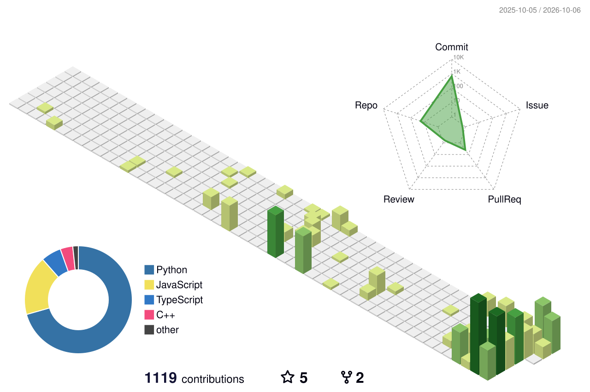

**Cagan Oflazoglu** · econometrics and machine learning · Amsterdam

Now: Pre-Master's programme in Econometrics at the University of Amsterdam, and a researcher on the Commodities Desk at Prometheus Capital, a student-run investment fund in Amsterdam.

Recent work: a free trainer for the Optiver online assessment, a camera-roll cleaner whose photos never leave your own devices, and an open Turkish speech model in development.

<picture>
  <source media="(prefers-color-scheme: dark)" srcset="profile-3d-contrib/profile-night-green.svg">
  
</picture>

### Selected work

- **[OptPrep](https://coflazo.github.io/optprep/)** ([repo](https://github.com/Coflazo/optprep)): free practice for the Optiver online assessment. Seven tasks on their real clocks and nine Zap-N games; 3,094 generated questions re-checked by a C++20 engine (order-book branch and bound, Monte Carlo) with zero failures; 142 lessons, and every wrong option names the misconception that leads to it. 793 tests, no runtime dependencies, works offline. `npx optprep`. JavaScript, C++, Python.
- **[Phone Memory Slider](https://github.com/Coflazo/phone-memory-slider)**: cleanup for your camera roll that stays on your own devices. A preference model trained on your favourites ranks duplicates, screenshots and blurry shots, you swipe to decide, and anything you drop goes to Android's recoverable trash. Pairing runs over TLS with a pinned certificate; no account, no cloud. Beta. C++23, Qt, Kotlin.
- **[Liminal](https://github.com/foxymadeit/medpark-challenge)**: meeting minutes in Romanian, Russian and English for Medpark, Moldova's largest private hospital, from meetings that switch language mid-sentence, on a server with no connection out. 2nd place, DeepTech GigaHack 2026 HealthTech track. 100% of decisions found and correct, with no trap fallen for across 19 model runs; 93% speaker accuracy, live, on a laptop CPU; character error cut to 20.6% by decoding every utterance twice; 506 tests. Team of five; I worked on the AI/ML and backend. Python.
- **[ML Factory](https://github.com/AtillaErsezen/Baklava/tree/supabase-results-store-parked)**: give it a CSV and a target column. An agent runs 33 statistical checks, ranks about 3,000 pipelines, races a 27-config shortlist in parallel on Modal, and confirms the winner on 10 paired folds with corrected t and Bayesian tests against a holdout locked before any diagnostic runs. Built for the Accel Hackathon. Python.
- **[CamToParkingSlot](https://github.com/Coflazo/CamToParkingSlot)**: parking search that matches RDW vehicle dimensions against Amsterdam's 210,247 surveyed bays and reads 69 live street cameras for free spaces: 0.00% false fits, 170 ms search. Python, C++.
- **[VC-Alpha-Signal-Finder](https://github.com/Coflazo/VC-Alpha-Signal-Finder)**: evaluation engine for early-stage venture. Reads seven public sources, builds founder and company dossiers, and scores each against a plain-English thesis with the evidence attached; a browser extension sends the page you are reading to the engine and shows its verdict. Python.

### In development

**turkish-sa-asr** (private until release): Turkish speech recognition that also says who spoke. The bar is the best published Turkish score, 4.71% WER on FLEURS-tr from a closed API; the best open model scores 5.77% in the project's own harness. So far: 966.5 hours of training speech checked against every test set, 1,519.8 hours of parliament audio aligned to the official record, six open models scored on four sealed test sets.

### Competitions

| When | Event | Result |
|---|---|---|
| Sep 2026 | DeepTech GigaHack 2026, HealthTech track | 2nd place ([Liminal](https://github.com/foxymadeit/medpark-challenge)) |
| Apr 2026 | AI020 Gov Tech Hackathon | Winner ([congressmAIn](https://github.com/Coflazo/congressmAIn)) |
| Mar 2026 | ML6 Enterprise AI Hackathon | Winner, team lead |
| Feb 2026 | ING Global Hackathon, Student Track | Winner, team lead |
| Feb 2026 | Polderr Heavy Machinery Hackathon | Winner (SiteMarshall) |
| Dec 2025 | MarktLink M&A case competition | 1st place |
| Oct 2025 | Picnic Technologies case competition | 1st place |
| Nov 2024 | Henkel business case, Sefa Career Week | 2nd place |

### More

[Lou](https://github.com/Coflazo/Lou) (controlled legal memory: contract clauses mapped to a playbook, 63 tests; built for the START Munich hackathon, Siemens track) · [Was-Liberation-a-Delusion](https://github.com/Coflazo/Was-Liberation-a-Delusion) (BSc thesis: PPML gravity model on the 2025 US tariffs, with the full replication pipeline) · [Octant-AI](https://github.com/Coflazo/Octant-AI) (agent that turns an investment thesis into a financial model and a research report) · [calibrcv-cli](https://github.com/Coflazo/calibrcv-cli) (offline resume optimizer with LaTeX output) · [Portfolio-Manager](https://github.com/Coflazo/Portfolio-Manager) (trades only on a unanimous five-model vote plus a risk gate; work in progress) · [TCDD-Koltuk-Bul](https://github.com/Coflazo/TCDD-Koltuk-Bul) (catches freed-up seats on sold-out Turkish State Railways trains) · [mental-math-forge](https://github.com/Coflazo/mental-math-forge) (mental arithmetic trainer) · [neilization](https://github.com/Coflazo/neilization) (Claude skill for public-science prose)

[LinkedIn](https://www.linkedin.com/in/cagan-oflazoglu)
